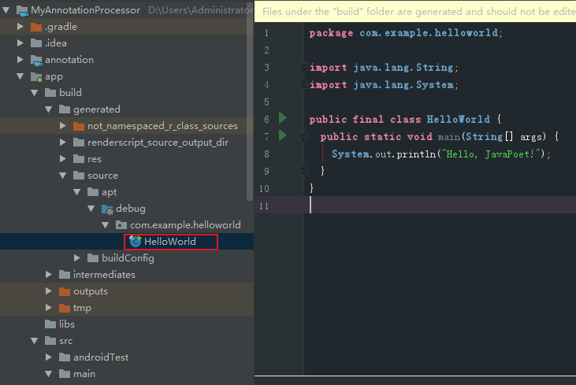
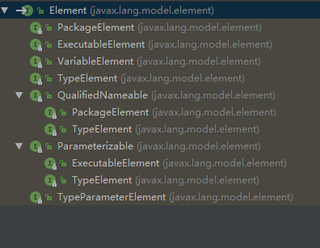

# 一、创建 annotation 的 Java 模块并配置

新建注解：
``` 
@Target(ElementType.TYPE)
@Retention(RetentionPolicy.CLASS)
public @interface Test {
}
```
build.gradle:
``` 
apply plugin: 'java-library'

dependencies {
    implementation fileTree(dir: 'libs', include: ['*.jar'])
}

sourceCompatibility = "7"
targetCompatibility = "7"

```

# 二、创建 annotationCompiler 的 Java 模块并配置

```
@AutoService(Processor.class)//必须
public class TestProcessor extends AbstractProcessor {
    @Override
    public Set<String> getSupportedAnnotationTypes() {
        //指定需要处理的注解
        return Collections.singleton(Test.class.getCanonicalName());
    }

    @Override
    public boolean process(Set<? extends TypeElement> annotations, RoundEnvironment roundEnv) {
        //指定生成方法
        MethodSpec main = MethodSpec.methodBuilder("main")
                .addModifiers(Modifier.PUBLIC, Modifier.STATIC)
                .returns(void.class)
                .addParameter(String[].class, "args")
                .addStatement("$T.out.println($S)", System.class, "Hello, JavaPoet!")
                .build();
        //指定生成类
        TypeSpec helloWorld = TypeSpec.classBuilder("HelloWorld")
                .addModifiers(Modifier.PUBLIC, Modifier.FINAL)
                .addMethod(main)
                .build();
        //指定生成Java文件
        JavaFile javaFile = JavaFile.builder("com.example.helloworld", helloWorld)
                .build();
        try {
            javaFile.writeTo(processingEnv.getFiler());
        } catch (IOException e) {
            e.printStackTrace();
        }
        return false;
    }
} 
```

build.gradle:

``` 
apply plugin: 'java-library'

dependencies {
    implementation fileTree(include: ['*.jar'], dir: 'libs')
    //注解 processor 类，并对其生成 META-INF 的配置信息
    implementation 'com.google.auto.service:auto-service:1.0-rc2'
    //生成代码工具
    implementation 'com.squareup:javapoet:1.8.0'
    //依赖注解
    implementation project(':annotation')
}

sourceCompatibility = "7"
targetCompatibility = "7"

```

# 三、配置 app （android 模块）

build.gradle:

``` 
apply plugin: 'com.android.application'

android {
    compileSdkVersion 28
    defaultConfig {
        applicationId "com.example.myannotationprocessor"
        minSdkVersion 15
        targetSdkVersion 28
        versionCode 1
        versionName "1.0"
        testInstrumentationRunner "android.support.test.runner.AndroidJUnitRunner"
    }
    buildTypes {
        release {
            minifyEnabled false
            proguardFiles getDefaultProguardFile('proguard-android-optimize.txt'), 'proguard-rules.pro'
        }
    }
}

dependencies {
    implementation fileTree(include: ['*.jar'], dir: 'libs')
    implementation 'com.android.support:appcompat-v7:28.0.0'
    implementation 'com.android.support.constraint:constraint-layout:1.1.3'
    testImplementation 'junit:junit:4.12'
    androidTestImplementation 'com.android.support.test:runner:1.0.2'
    androidTestImplementation 'com.android.support.test.espresso:espresso-core:3.0.2'
    //依赖注解
    implementation project(':annotation')
    //依赖注解处理器
    annotationProcessor project(':compiler')
}

```
使用注解：
``` 
@Test
public class MainActivity extends AppCompatActivity {

    @Override
    protected void onCreate(Bundle savedInstanceState) {
        super.onCreate(savedInstanceState);
        setContentView(R.layout.activity_main);
    }
}
```
# 四、rebuild项目：

在app模块的 build/generated/source/apt/debug 可找到生成的类：




# 注解知识：

java中元注解有四个： @Retention @Target @Document @Inherited；

@Retention：注解的保留位置　
　　　　　　　　
> @Retention(RetentionPolicy.SOURCE)   //注解仅存在于源码中，在class字节码文件中不包含
@Retention(RetentionPolicy.CLASS)     // 默认的保留策略，注解会在class字节码文件中存在，但运行时无法获得，
@Retention(RetentionPolicy.RUNTIME)  // 注解会在class字节码文件中存在，在运行时可以通过反射获取到


@Target:注解的作用目标

> @Target(ElementType.TYPE)   //接口、类、枚举、注解
@Target(ElementType.FIELD) //字段、枚举的常量
@Target(ElementType.METHOD) //方法
@Target(ElementType.PARAMETER) //方法参数
@Target(ElementType.CONSTRUCTOR)  //构造函数
@Target(ElementType.LOCAL_VARIABLE)//局部变量
@Target(ElementType.ANNOTATION_TYPE)//注解
@Target(ElementType.PACKAGE) ///包   

@Document：说明该注解将被包含在javadoc中

@Inherited：说明子类可以继承父类中的该注解

# AbstractProcessor

参考：[利用APT实现Android编译时注解](https://blog.csdn.net/mcryeasy/article/details/52740041)

``` 
public abstract class AbstractProcessor implements Processor {
}

public interface Processor {
    //指定哪些注解应该被注解处理器注册。
    //可用@SupportedOptions({
    //            "proxytool.ViewById",
    //            "proxytool.OnClick"
    //    }) 代替,考虑到兼容性问题，
    //建议还是重写getSupportedSourceVersion方法和getSupportedAnnotationTypes方法
    //它的返回值是一个String集合，包含了你的注解处理器想要处理的注解类型的全限定名。
    Set<String> getSupportedOptions();

    //指定哪些注解应该被注解处理器注册。
    //可用@SupportedAnnotationTypes({
    //            "proxytool.ViewById",
    //            "proxytool.OnClick"
    //    }) 代替，考虑到兼容性问题，
    //建议还是重写getSupportedSourceVersion方法和getSupportedAnnotationTypes方法
    //它的返回值是一个String集合，包含了你的注解处理器想要处理的注解类型的全限定名。
    Set<String> getSupportedAnnotationTypes();

    //用来指定你使用的 java 版本，通常我们返回SourceVersion.latestSupported()即可。
    //可用 @SupportedSourceVersion(SourceVersion.RELEASE_7) 代替
    SourceVersion getSupportedSourceVersion();

    //通过processingEnv参数我们可以拿到一些实用的工具类Elements, Messager和Filer。
    //Elements，一个用来处理Element的工具类。
    //Messager，一个用来输出日志信息的工具类。
    //Filer，使用这个类来创建文件。
    void init(ProcessingEnvironment var1);

    //这是注解处理器的主方法，你可以在这个方法里面编码实现扫描，处理注解，生成 java 文件。
    //返回值 表示这组 annotations 是否被这个 Processor 接受，
    //如果接受（true）后续子的 pocessor 不会再对这个 Annotations 进行处理
    boolean process(Set<? extends TypeElement> var1, RoundEnvironment var2);

    Iterable<? extends Completion> getCompletions(Element var1, AnnotationMirror var2, ExecutableElement var3, String var4);
}
```
# RoundEnvironment

[官方文档](http://www.cjsdn.net/Doc/JDK60/javax/annotation/processing/RoundEnvironment.html)

``` 
public interface RoundEnvironment {
    boolean processingOver();

    boolean errorRaised();

    Set<? extends Element> getRootElements();

    Set<? extends Element> getElementsAnnotatedWith(TypeElement var1);

    //返回使用给定注解类型注解的元素集合。
    Set<? extends Element> getElementsAnnotatedWith(Class<? extends Annotation> var1);
}
```


# Element



``` 
PackageElement：
代表一个包名。 

TypeElement：
代表一个类、接口、枚举。

ExecuteableElement：
可以表示一个普通方法、构造方法、初始化方法（静态和实例）。

VariableElement：
代表一个字段、枚举常量、方法或构造方法的参数、本地变量、或异常参数等。

Element：
上述所有元素的父接口，代表源码中的每一个元素。

```

``` 
public interface Element extends AnnotatedConstruct {
    TypeMirror asType();

    //返回element的类型，判断是哪种element，可查看 ElementKind 类
    ElementKind getKind();

    //获取修饰关键字,如：public static final等关键字
    Set<Modifier> getModifiers();

    //获取名字，不带包名
    //getQualifiedName：获取带包名的名字
    //Android框架层注解 if (qualifiedName.startsWith("android.")) {}
    //   java框架层注解 if (qualifiedName.startsWith("java.")) {}
    Name getSimpleName();

    //返回该element的【父级element】，
    //VariableElement，方法ExecutableElement的父级是TypeElemnt，
    //而TypeElemnt的父级是PackageElment
    Element getEnclosingElement();

    //返回该元素的【子级element】,
    //通常对一个PackageElement而言，它可以包含TypeElement；
    //对于一个TypeElement而言，它可能包含属性VariableElement或者方法ExecutableElement,
    List<? extends Element> getEnclosedElements();

    boolean equals(Object var1);

    int hashCode();

    //返回直接存在于此元素上的注解。
    List<? extends AnnotationMirror> getAnnotationMirrors();

    //返回此元素针对指定类型的注解（如果存在这样的注解），否则返回 null。
    <A extends Annotation> A getAnnotation(Class<A> var1);

    <R, P> R accept(ElementVisitor<R, P> var1, P var2);
}
```
#### ExecutableElement
``` 
public interface ExecutableElement extends Element, Parameterizable {
    //获取方法的参数
    List<? extends TypeParameterElement> getTypeParameters();

    //获取方法的返回值
    TypeMirror getReturnType();

    List<? extends VariableElement> getParameters();

    TypeMirror getReceiverType();

    boolean isVarArgs();

    boolean isDefault();

    List<? extends TypeMirror> getThrownTypes();

    AnnotationValue getDefaultValue();

    Name getSimpleName();
}
```
##### VariableElement:
``` 
public interface VariableElement extends Element {
    //如果属性变量被final修饰，则可以使用该方法获取它的值
    Object getConstantValue();

    Name getSimpleName();

    Element getEnclosingElement();
}

```

